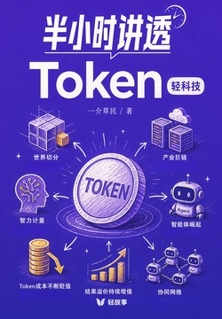

# 半小时讲透Token（轻科技）

> 作者：一介草民 · 轻科技系列

## 写在前面

如果说"千瓦时"定义了电力时代、"桶"定义了石油时代，那么 **Token** 就是人工智能时代的核心计量单位。

这本《半小时讲透Token（轻科技）》用极短的篇幅，把 AI 时代最容易被忽视的"度量衡"讲透了：
Token 不只是大模型处理文字的最小片段，更是一把**丈量新经济**的尺子。

---

## 全书脉络

全书分五章一结语，层层递进：

| 章节 | 主题 | 一句话回答 |
| --- | --- | --- |
| 第一章　认识 Token | AI 世界的"原子" | Token 是什么、怎么计费、为什么不是所有 Token 都一样值钱 |
| 第二章　看懂产业 | 谁在造"Token 工厂" | 算力 = 电厂，大模型 = 智力批发，云巨头 = 自来水管公司 |
| 第三章　抓住红利 | 当智力比水还便宜 | 暴力计算可行、成本结构变化、效率差就是利润差 |
| 第四章　避开陷阱 | 聊天框撑不起一门生意 | 单纯答疑只是"查信息"，能"办成事"才是产品 |
| 第五章　找到方向 | Agent 与结果交付 | 从"等用户问"到"自己把事做完"，未来属于编排者 |

---

## 第一章　认识 Token

### 1.1 万物皆可打碎 —— AI 眼中的世界长什么样？

Token 是大模型处理信息的**最小语义片段**，不是字，也不是词，是 AI 自己学出来的"文字碎片"：

- **英文**：`Artificial intelligence is transforming our world` ≈ 8 个 Token
- **中文**：`人工智能正在改变我们的世界` ≈ 12 个 Token
- 经验换算：英文 1 Token ≈ 0.75 单词；中文 1 Token ≈ 1.5~2 个汉字
- 切分靠 **Tokenizer**，训练靠 **BPE（字节对编码）** —— 像快递打包员一样把高频组合并成大包

### 1.2 从"买软件"到"买智力"

计费方式的变革，背后是商业逻辑的彻底切换：

| 时代 | 卖的是什么 | 计费单位 |
| --- | --- | --- |
| 软件时代 | 许可证 | 套/账号 |
| SaaS 时代 | 服务订阅 | 月/账号 |
| AI 时代 | 智力调用 | **Token** |

钱不再为"功能"买单，而为"推理量"买单。

### 1.3 不是所有 Token 都一样值钱

- **输入 Token** 和 **输出 Token** 价差巨大（输出贵 3~5 倍）
- **思考 Token**（CoT、ReAct 内部推理）用户看不见，却在烧钱
- **缓存命中 / 未命中**直接决定成本差一个数量级
- **模型分层**：不同档位模型的"单 Token 价格"差出几十倍

---

## 第二章　看懂产业

### 2.1 算力 —— 这个时代最贵的"电厂"

> "门票动辄几十亿。"

算力就是 AI 时代的发电厂，资本壁垒极高：
H100/H200 集群、超大规模数据中心、长协电力 —— 不再是互联网公司的菜，是**国家级重资产**。

### 2.2 大模型 —— 卖"智力批发"的人，正在打价格战

- 训练一次顶尖模型的成本以**亿美元**计
- OpenAI、Anthropic、Google、DeepSeek、阿里、字节……所有人都在卷**单 Token 降价**
- 卖"通用智力"的毛利越来越薄，模型层正在被上下挤压

### 2.3 云巨头 —— 铺设"智力自来水管"的人，才是最后的赢家？

AWS、Azure、阿里云、火山引擎…… **Token 最终会像水电一样从管道里流出**。
云厂商把"算力 + 模型 + 工具链"打包成按 Token 计价的云服务，吃掉产业链最大一块利润。

---

## 第三章　抓住红利

### 3.1 当智力比水还便宜，世界会怎样？

> 杰文斯悖论在 AI 时代重演：效率提升不会让总消耗下降，反而让总消耗**暴涨**。

廉价智力 → 更多场景被解锁 → 总 Token 消耗指数级增长。

### 3.2 以前要省着用，现在可以暴力计算

- 长上下文、多轮 Agent、Tool Use、CoT 反思……以前"省 Token"是核心能力
- 现在 Token 单价暴跌，**"敢用"比"省着用"更能产出价值**

### 3.3 同样用 AI，为什么有人的成本比你低一半？

- **Prompt 工程**：结构化提示词显著减少无效输出
- **模型路由**：简单任务用小模型，复杂任务才用大模型
- **缓存 + 批处理**：重复内容走命中，单次请求打批量
- **RAG 替代长上下文**：检索永远比"全塞进去"便宜

---

## 第四章　避开陷阱

### 4.1 一个聊天框，撑不起一门生意

> "对话"是 AI 能力的展示窗口，但不是产品。

光有聊天框，没有场景、没有工作流、没有数据沉淀 —— 留存为零。

### 4.2 "帮你查信息"和"帮你办成事"，中间隔着一条河

- **查信息型产品**：替代搜索引擎 → 低频、缺壁垒
- **办成事型产品**：替代员工/外包 → 高频、高 LTV

能不能"动手"（调用工具、操作外部系统），决定了你做的是**玩具**还是**工具**。

### 4.3 用户用一次就走了，你的产品凭什么让他留下来？

- 没有**数据沉淀**，用户每次都从零开始
- 没有**协作场景**，就是一次性消费
- 没有**结果交付**，用户永远在"试用"，从不"依赖"

---

## 第五章　找到方向

### 5.1 什么是 Agent？从"等你发问"到"自己把事做完"

Agent = **大模型 + 记忆 + 工具 + 规划能力**

它不是更强的聊天框，而是能：
1. 自己拆解目标
2. 自己选择工具
3. 自己观察结果
4. 自己迭代下一步

### 5.2 不卖过程，卖结果 —— 下一代 AI 产品的商业逻辑

- 过去卖"软件"：交付的是工具，用户自己用
- 过去卖"服务"：交付的是工时，按人天计费
- 未来卖"结果"：交付的是**办成的事**，按结果计价

> 卖过程 = 按 Token 计价的 API；卖结果 = 按业务价值计价的 Agent 服务。

### 5.3 当无数个 Agent 开始协作，一个新的世界诞生了

- 单 Agent → 多 Agent 协作（Orchestrator + Workers）
- Agent 之间通过 **MCP、A2A 协议**互联
- 个人 / 小团队可以指挥一群 Agent 干完以前大公司的活

---

## 结语

> 这些篇章共同描绘了一幅蓝图：**未来属于那些能深入具体领域、定义有价值任务，并指挥无数 Agent 协同工作的人。**

整本书半小时就能读完，但读完之后你会重新理解三件事：

1. **Token 是新度量衡** —— 你的每一次 AI 调用，都在被这把新尺子丈量
2. **Agent 是新交付物** —— 不再卖工具，卖办成的事
3. **编排者是新角色** —— 价值从"写代码"迁移到"调度 Agent"

---

## 我的总结

> **从写代码到写 Agent，从写 Agent 到被 Agent 取代，不论是写代码还是写 Agent，都是作为「工具人」的一环。终点只有一句话：「你的 Agent 真润」。**

读完这本书，最大的冲击不是"Token 是什么"，而是**"工具人的终点在哪"**。

写代码时，你是翻译机——把业务规则译成 if-else。写 Agent 时，你是编排者——把业务目标拆成任务图。看起来升了一级，但仔细想想：**你只是换了一种语言，在同一个坐标系里移动。**

Agent 不会停在"被你编排"的位置。当你把它调得够润——自动拆任务、自动选工具、自动交付结果——它就不再需要你。

**"你的 Agent 真润"**，润到让你出局。

这不是末日论，是实话。Token 在贬值，编排者的价值也在贬值。
唯一不变的是：**工具永远在找更少的人。**
